# Markers Tab

# ==================================
EASY RIGIFY — MARKERS TAB GUIDE
A complete guide to placing markers and generating a rigged, skinned character

CONTENTS
Section 1 — Overview and workflow
Section 2 — Markers tab (step-by-step placement)
Section 3 — Full workflow — step by step
Section 4 — Tips, warnings, and troubleshooting

# ==================================
SECTION 1 — OVERVIEW AND WORKFLOW

## WHAT MARKERS ARE

Markers are small, visible empties you place on your character. Each one
tells Easy Rigify where a joint belongs—such as a shoulder, a knuckle, or an
eye corner. Once the markers are in place, the add-on snaps a Rigify metarig
to them, so you never have to line up bones in Edit Mode by hand.

Markers are standard Blender empties. You can select them, grab them (G),
and nudge any that land in the wrong spot. Adjusting a marker is always
just click-and-drag—there is nothing hidden to "commit".

## WHERE IT LIVES

Everything lives in the 3D Viewport sidebar. Press N in the viewport and open
the "Easy Rigify" tab. The tab has four sub-tabs:

MARKERS — place markers on the body, hands, and face (this guide)
RIG     — add a metarig, align it to markers, generate
SKIN    — bind the mesh and clean up weights
TOOLS   — fan bones and viewport helpers

## THE BIG PICTURE

1. Pick your body mesh.
2. Detect the body, then the fingers, then the face.
3. Fix any markers that are off, then mirror one good side across.
4. Run "Check All Markers".
5. Go to the Rig tab: align and generate.
6. Go to the Skin tab: bind and clean up.

Detection is a starting point, not the finish line—expect to nudge a few
markers by hand on stylised or unusual characters. That is normal and fast.

## EDITIONS

- Full edition: adds one-click AI detection (EasyDetect Body / Fingers /
Face) alongside the geometric detectors.
- Lite edition: geometric detection only. The EasyDetect buttons and the
finger-engine switch do not appear; everything else is identical.

A scene saved in one edition will open in the other.

# ==================================
SECTION 2 — MARKERS TAB (STEP-BY-STEP PLACEMENT)

The Markers tab is laid out top to bottom in the order you use it.

**2.1 BODY MARKERS** (Step ①)

──────────────────────────────────────────────────────────────

- Body Mesh — set this to your character mesh first. It is remembered and
reused by every detector, so you only pick it once.
• Symmetrical Detect — when on, detection mirrors the left and right
sides so they match exactly. Leave it on for symmetric characters.
• ✦ EasyDetect Body (full edition) — neural body-marker placement. Best
on unusual proportions and stylised bodies.
• ① Auto Detect Body — geometric body-marker placement from the mesh
shape. Places pelvis, spine, neck, head, shoulders, arms, elbows,
hands, thighs, shins, feet, toes, and heels. Marker sizes auto-scale
to the character.

Either button places the full body-and-leg set. The scene is left as-is;
nothing is hidden.

──────────────────────────────────────────────────────────────

**2.3 FINGER MARKERS** (Step ③)

──────────────────────────────────────────────────────────────

**Engine (full edition): choose EasyDetect or Geometric.**

- EasyDetect — the full pipeline; best result per hand.
- Geometric — mesh-only detection, with its own tuning sliders:
Auto-snap Wrist — moves the HAND marker onto the mesh wrist before
detecting (the geometric walk starts there).
Knuckle Depth / Thumb Depth / Min Finger Size — tune placement for
thick, thin, or stylised hands.
In Lite there is no engine choice — the geometric engine (with the same
sliders) is always used.

- ✦ EasyDetect Fingers (or "Detect Fingers (Geometric)") — places every
hand and finger joint in one click. Requires the HAND and ELBOW markers
from body detection.
• ② Place All Fingers — a manual, two-clicks-per-finger workflow: first
click is the fingertip, second is the knuckle. The two middle joints
are interpolated between them, and the right hand mirrors from the left.
• The small down-arrow beside "Place All Fingers" opens a per-finger
picker, so you can redo just one finger (thumb, index, middle, ring,
pinky) instead of all of them.
• Straighten Finger Markers — projects each finger's joints onto its bend
plane, removing side-to-side wander while keeping the natural curl.
• Re-solve Selected Finger — re-runs detection for just the finger whose
markers you have selected.

**PLACE ALL FINGERS [button]**

──────────────────────────────

When you click on place all fingers it starts an interactive 2-click modal session for each finger. Click Tip first and then knuckles second for the thumb, move to the index finger and do the same, click on the tip of the finger and then the Knuckles. Do this for all five fingers, this automatically place markers for each finger. You can undo each step and redo the click.

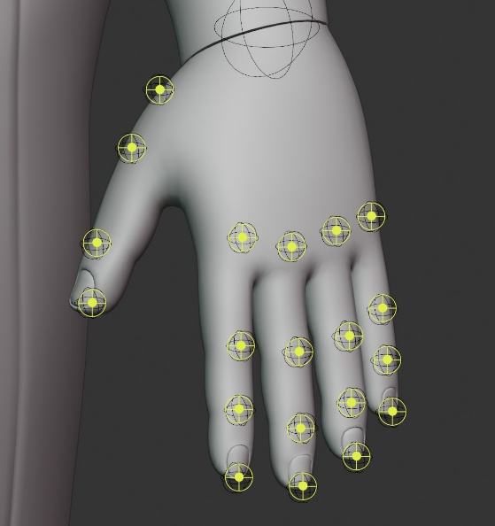

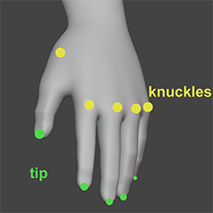

After all, five click, this mirrors the finger markers from Left to the Right side. You can the manually adjust each marker to fit the character finger for better bone placement.

Always mirror all adjustment to the Left or Right side when done.

**[▼] (Finger Picker popover) [small dropdown button]**

─────────────────────────────────────────────────────

Opens a panel where you can select individual fingers to place separately.

Useful if one finger was misplaced and you want to re-run just that one.

In the popover, check or select which finger(s) to place, then click

Place Selected Fingers.

──────────────────────────────────────────────────────────────

**2.4 FACIAL MARKERS** **(Step ⑥)**

──────────────────────────────────────────────────────────────

**Show Facial Markers [toggle button]**

─────────────────────────────────────

Expands or collapses the facial marker section. When off, facial markers

and their detection steps are hidden.

Turn this ON only when your character has a face rig. Leave it OFF for

body-only rigs (the Human (No Face) meta rig).

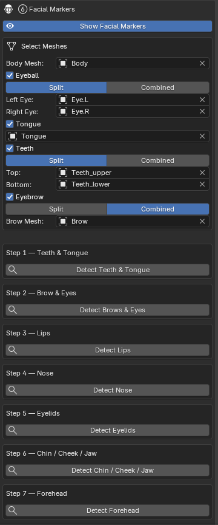

**SELECT MESHES**

──────────────────────────────────────────────────────────

You must assign mesh objects before running any detection step. The system

uses these meshes to project marker positions onto the correct geometry.

**Body Mesh** [object picker]

──────────

The main face/head mesh. Usually, the same object as the body mesh you set in the Body Markers section. Used for lips, nose, chin, cheeks, forehead, jaw, and temple markers.

**Eyeball [checkbox]**

────────

Enable if your character has separate eyeball objects.

**Eye Count [SINGLE / SPLIT**]

SINGLE — one eyeball mesh shared by both eyes (rare).

SPLIT — separate Left Eye and Right Eye objects (most common).

After enabling, pick the eyeball mesh(es) in the fields that appear.

Used for: eye lid detection, eye center marker placement.

**Tongue [checkbox]**

───────

Enable if your character has a separate tongue mesh.

Used for: tongue marker placement inside the mouth.

**Teeth [checkbox]**

──────

Enable if your character has separate teeth meshes.

**Teeth Count [SINGLE / SPLIT]**

SINGLE — one mesh for both upper and lower teeth.

SPLIT — separate Top and Bottom teeth objects.

Used for: upper/lower teeth marker placement.

**Eyebrow [checkbox]**

────────

Enable if your character has separate eyebrow mesh objects

**Brow Count [SINGLE / SPLIT]**

Similar to the eye/teeth split option.

**✦ EasyDetect Face (full edition) — one-click neural face-landmark
placement. need the eye mesh selected to work effectiv**

── **DETECTION STEPS** ────────────────────────────────────────────────────────

Run each step in order after assigning all meshes above. Each step projects

markers onto the mesh using geometry analysis.

**Step 1 — Teeth & Tongue [DETECT TEETH & TONGUE button]**

─────────────────────────────────────────────────────────

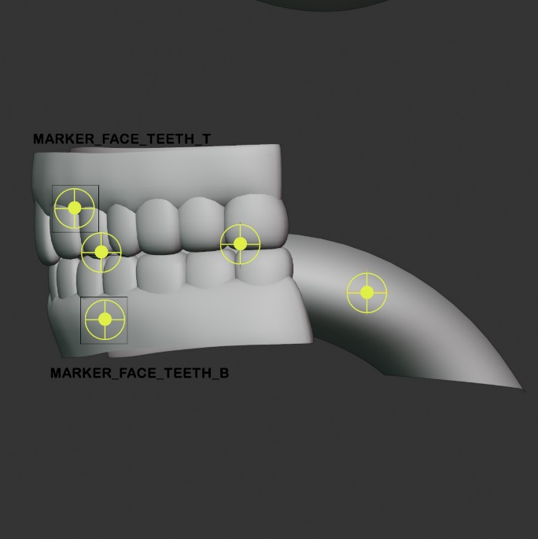

Detects the position and orientation of:

- **Upper and lower teeth** (FACE_TEETH_T, FACE_TEETH_B)
- **Tongue segments** (FACE_TONGUE, FACE_TONGUE_001, FACE_TONGUE_002)

And place markers for them. The markers need to be manually adjusted to fit the teeth and tongue. It places cube shape empty for the teeth and plain Axes for the tongue.

Requires: Teeth and/or Tongue enabled above with meshes assigned.

**Step 2 — Brow & Eyes [DETECT BROWS & EYES button]**

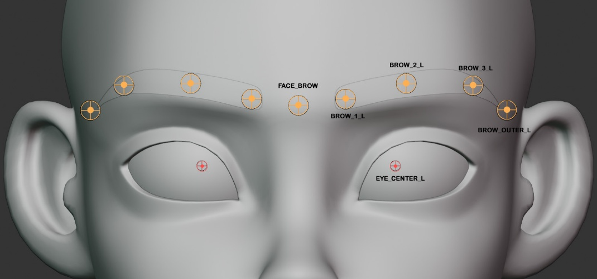

─────────────────────────────────────────────────────

Detects:

- Eyebrow and place 4 markers on each eyebrow
- Eyeball center and place a marker for the eyeball.

Requires: Brow Mesh assigned. Eyeball mesh(es) assigned if available.

**Step 3 — Lips [DETECT LIPS button]**

─────────────────────────────────────

Detects the lip contour:

- **Upper lip** (FACE_LIP_T, FACE_MOUTH_TOP_L/R)
- **Lower lip** (FACE_LIP_B, FACE_MOUTH_BOT_L/R)

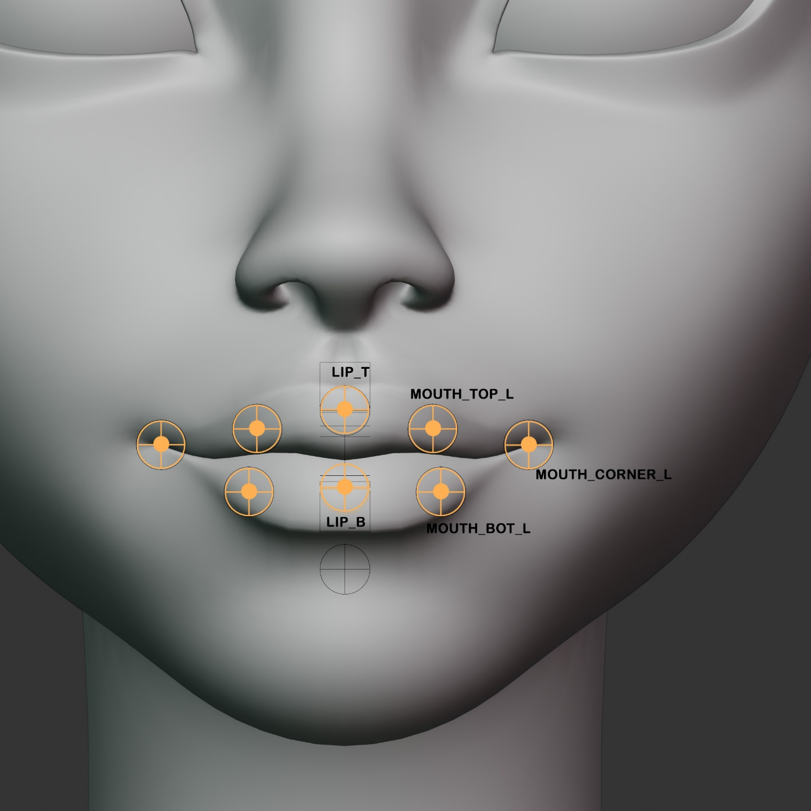

- 

**Mouth corners**

(FACE_MOUTH_CORNER_L/R)

Requires: Body Mesh assigned. Also need the teeth marker placed to get a better detection. The lip marker will need little adjustment to place them correctly on the characters lips.

**Step 4 — Nose [DETECT NOSE button]**

─────────────────────────────────────

Detects the nose shape:

- **Nose bridge** (L&R)
- **Nose tip**
- **Nose wing** (L&R)

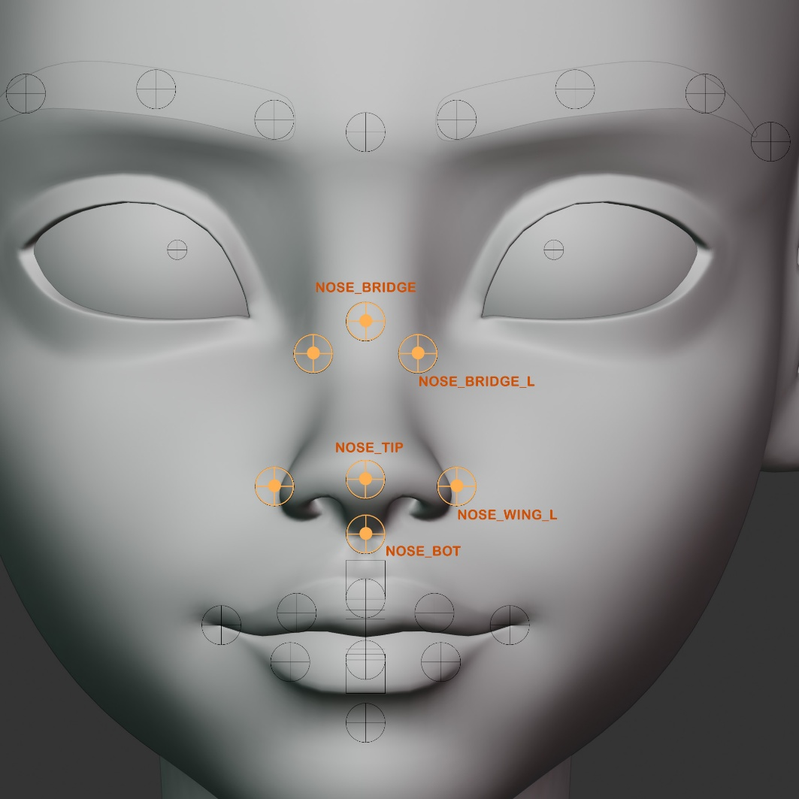

- Nose Bot

(lower part of the nose)

Requires: Body Mesh assigned.

**Step 5 — Eyelids [DETECT EYELIDS button]**

───────────────────────────────────────────

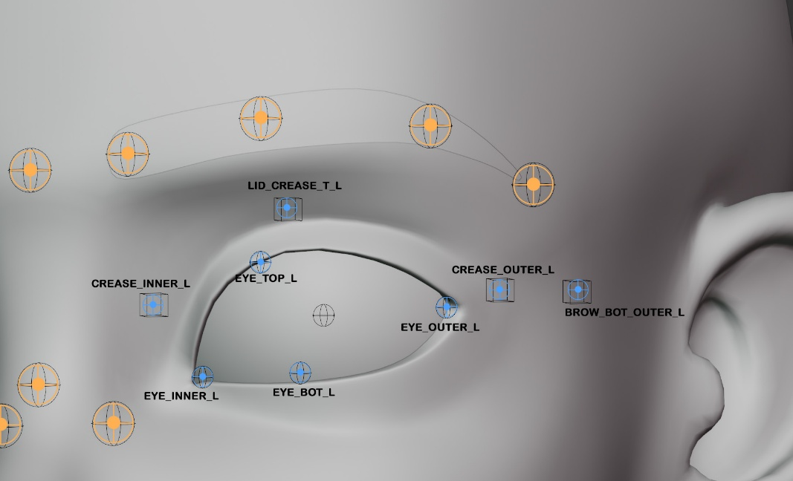

Detects:

- Upper and lower eyelid (eyelid top and eyelid bot)
- Eyelid crease points (crease line above the eyelid)
- Inner and outer lid corners (corner part of the eyelid)
- Brow_bot_outer extends outside the eyelid towards the ear.

Reference image and video for proper placement.

Requires: Body Mesh assigned. Eyeball mesh(es) highly recommended for

accurate eyelid projection.

**Step 6 — Chin / Cheek / Jaw [DETECT CHIN / CHEEK / JAW button]**

──────────────────────────────────────────────────────────────────

Detects:

- Chin centre and sides (FACE_CHIN, FACE_CHIN_L/R)
- Jaw line control points (FACE_JAW, FACE_JAW_SIDE_L/R)
- Cheek high points (FACE_CHEEK_T/B_L/R)
- Ear attachment point (FACE_EAR_L/R)

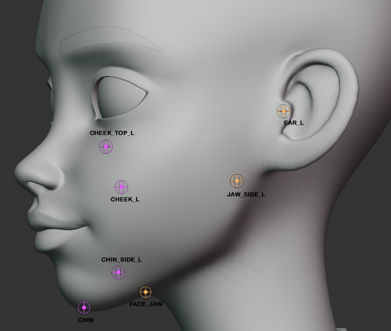

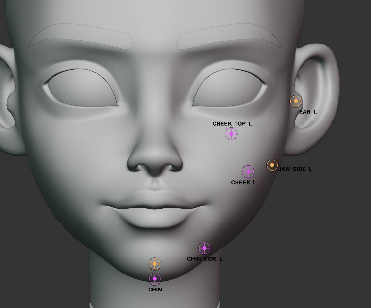

Requires: Body Mesh assigned.

**Step 7 — Forehead [DETECT FOREHEAD button]**

─────────────────────────────────────────────

Detects:

- Forehead center (FACE_FOREHEAD)
- Forehead side arc (FACE_FOREHEAD_SIDE_L/R)

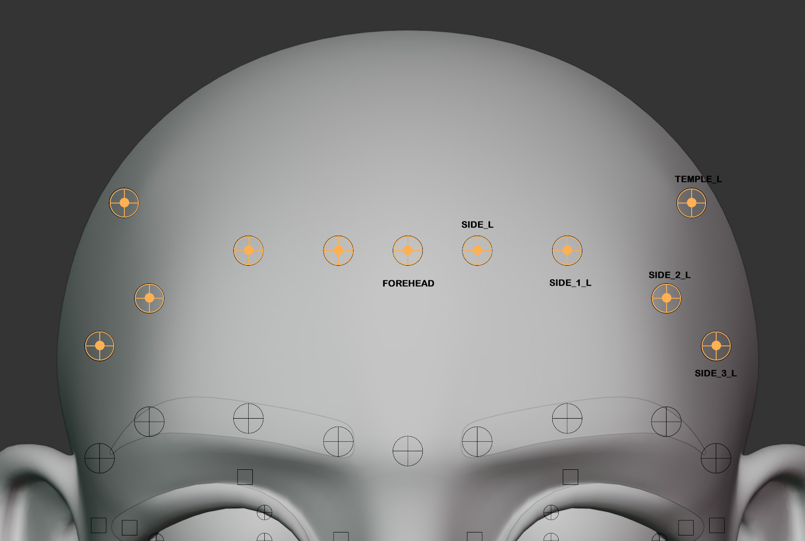

- Temple (FACE_TEMPLE_L/R)

Requires: Body Mesh assigned.

**── AFTER DETECTION** ────────────────────────────────────────────────────────

After detection, inspect the face markers in the viewport. The system

projects markers onto the nearest mesh surface geometry. For stylized

characters, some markers may need manual fine-tuning.

To adjust a face marker:

1. Click on it in the viewport to select it.
2. Move it with G (grab).
3. Face markers accept any position — the alignment reads them in

the same way as manually placed markers.

─────────────────────────────────────────────────────────────────────────────

**2.5 DELETE ALL MARKERS [button]**

─────────────────────────────────────────────────────────────────────────────

Removes all body AND face markers from the scene and deletes both the

RigifyMarkers and RigifyFaceMarkers collections.

Use this to start fresh if you need to redo the entire placement.

WARNING: This cannot be undone in the usual sense — the empties are deleted

from the scene. If you want to keep the markers for reference, save the

file first.

─────────────────────────────────────────────────────────────────────────────

**2.6 MIRROR [box]**

──────────────────────────────────────────────────────────

- **Live Symmetry — while on, moving a marker on one side moves its
counterpart on the other in real time.**

**MIRROR L→R [button]**

─────────────────────

Copies all _L markers to their _R counterparts by mirroring the X position

(negates X, preserves Y and Z).

Use after manually repositioning left-side markers to keep both sides

symmetrical.

**R→L [button]**

──────────────

Same in reverse — copies RIGHT side markers to the LEFT side.

IMPORTANT: Mirror only copies position. It does not check whether the

mirrored position lands on the mesh surface. If your character is not

symmetrical (e.g. a costume with different details on each side) you may

need to manually adjust the mirrored markers.

─────────────────────────────────────────────────────────────────────────────

**2.7 MARKER COUNT [status line]**

─────────────────────────────────────────────────────────────────────────────

Shows X/Y body markers placed (e.g. "18/24 body markers placed").

When all markers are placed the icon changes from INFO to a checkmark.

This count covers only BODY markers. Face markers are not included.

─────────────────────────────────────────────────────────────────────────────

**2.8 VIEWPORT CONTROLS [box]**

─────────────────────────────────────────────────────────────────────────────

**SHOW MARKERS / HIDE MARKERS [toggle button]**

────────────────────────────────────────────

Hides or shows the entire RigifyMarkers collection. Useful to declutter

the viewport while checking marker positions against the mesh.

The button label updates to reflect the current state.

**X-RAY [button]**

────────────────

Toggles X-Ray mode on the active viewport. With X-Ray ON, the markers

are visible through the mesh, making it easier to place markers at joint

centers inside the body.

Turn ON when placing hip, pelvis, and spine markers which are typically

inside the mesh geometry.

**MESH SELECTION [button]**

─────────────────────────

Toggles whether the character mesh is selectable in the viewport.

Turn OFF (mesh not selectable) when you want to click-to-place markers

without accidentally selecting the mesh. Turn back ON for normal work.

**MARKER HINTS [checkbox]**

─────────────────────────

When ON (default), selecting any marker shows a colored hint overlay in

the top-right corner of the 3D viewport with:

- The marker's anatomical name
- A short description of where it should be placed
- A color-coded category (blue = body, green = arm, orange = finger,

pink = face)

Turn OFF if the overlay is distracting.

# ====================================
SECTION 3 — FULL WORKFLOW — STEP BY STEP

## STEP 1 — PREPARE THE MESH

Before anything else, apply scale and rotation on your character:
Object > Apply > All Transforms. Unapplied scale is the single most
common cause of bad alignment and binding. Do this once, up front.

## STEP 2 — PICK THE BODY MESH

Markers tab > Body Markers > Body Mesh. Set it to your character. This is
reused by every detector.

## STEP 3 — DETECT THE BODY

Click "Auto Detect Body" (or "EasyDetect Body" in the full edition). The
spine, arms, legs, and feet markers appear. Orbit around and check them;
grab (G) and nudge any that are off.

## STEP 4 — DETECT THE FINGERS

Click "EasyDetect Fingers" (or "Detect Fingers (Geometric)"). If the
hands need work, use "Place All Fingers" for a manual pass, the per-finger
picker to redo one finger, or "Straighten Finger Markers" to tidy wander.

## STEP 5 — DETECT THE FACE (optional)

Expand "Show Facial Markers", pick your eye/teeth/brow/tongue meshes, then
run "EasyDetect Face" or the Step 1–7 detectors in order. Correct each
region as you go.

## STEP 6 — MIRROR AND CORRECT

Refine one side, then use "Mirror L→R" (or R→L) to copy it across. Turn on
Live Symmetry if you want both sides to move together while you adjust.

## STEP 7 — CHECK

Run "Check All Markers". Fix anything it reports before moving on —
aligning consumes the markers, so they need to be correct now.

## STEP 8 — ALIGN AND GENERATE (Rig tab)

Switch to the Rig tab. Add a Rigify metarig, click "Align Rig to Markers"
to snap every bone onto your markers (bone rolls included), then
"Generate Rig" to produce the final Rigify control rig.

## STEP 9 — BIND AND CLEAN UP (Skin tab)

Switch to the Skin tab. Bind the mesh with Smart Bind, then use the weight
tools — surgical joint tightening, smoothing, symmetry, cleanup — to
polish the deformation.

# ===============================================================================
SECTION 4 — TIPS, WARNINGS, AND TROUBLESHOOTING

## TIPS

- APPLY TRANSFORMS FIRST. Object > Apply > All Transforms on the body mesh
before you detect anything. Unapplied scale in particular ruins both
alignment and binding.
• DETECTION IS A STARTING POINT. Treat auto-placed markers as 90% done and
plan to nudge a few by hand. That is faster than perfect placement and
completely normal.
• MIRROR TO SAVE TIME. Perfect one side, then mirror it across instead of
placing both sides by hand.
• USE MESH SELECTION. Turn on the Mesh Selection lock so you grab markers,
not the body, while correcting.
• X-RAY FOR INTERIOR JOINTS. Turn on X-Ray to reach markers that sit
inside the mesh (hips, shoulders).
• CHECK BEFORE YOU ALIGN. Always run "Check All Markers" first — aligning
consumes the markers, so problems are cheaper to fix beforehand.
• FINGERS: TIP THEN KNUCKLE. In manual placement the first click is always
the fingertip, the second the knuckle.

## WARNINGS

- Aligning the rig consumes the markers — make sure they are correct
first.
• "Delete All Markers" clears everything with no per-marker undo prompt.
• Finger detection needs the HAND and ELBOW markers from body detection.
Detect the body before the fingers.

## TROUBLESHOOTING

MARKERS LAND IN THE WRONG PLACE / EVERYTHING LOOKS SKEWED
Almost always unapplied scale or rotation. Undo, apply all transforms,
and detect again.

DETECTION SEEMS TO DO NOTHING
Confirm the Body Mesh picker points at your actual character mesh (not
a marker, an eye, or a stray object), and that the object still exists
in the scene.

FINGERS ARE MISSING OR COLLAPSED
Make sure the body was detected first (fingers need HAND and ELBOW). On
stylised hands, switch to the Geometric engine and adjust Knuckle Depth,
Thumb Depth, and Min Finger Size, or place them manually.

A FEW MARKERS ARE OUTSIDE THE MESH
"Check All Markers" flags these. Select each one, turn on X-Ray, and
drag it back onto the surface — or re-run detection.

THE EASYDETECT (AI) BUTTONS ARE NOT SHOWING
You are on the Lite edition (geometric only), or the AI runtime could
not load on your platform. The geometric detectors do the same job and
are always available.

THE RIG DEFORMS BADLY AFTER BINDING
Re-check that scale was applied before binding, then use the Skin tab's
surgical tightening and smoothing on the affected joints.

# ====================================
For the full manual (Rig tab, Skin tab, Tools tab, and AI detection) see
DOCUMENTATION.txt or the online documentation linked from the addon's Help
button.