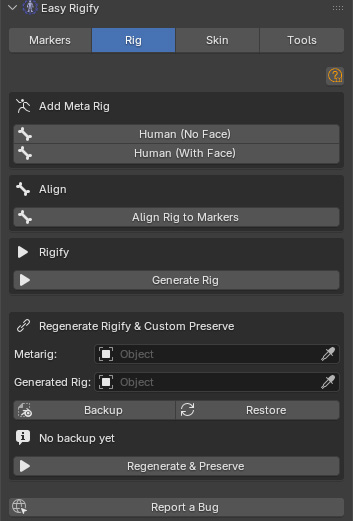
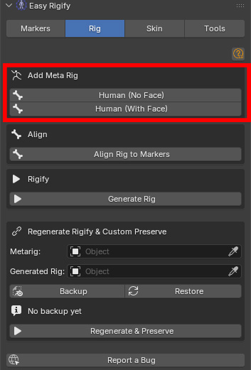
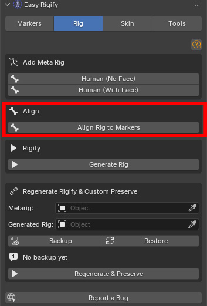
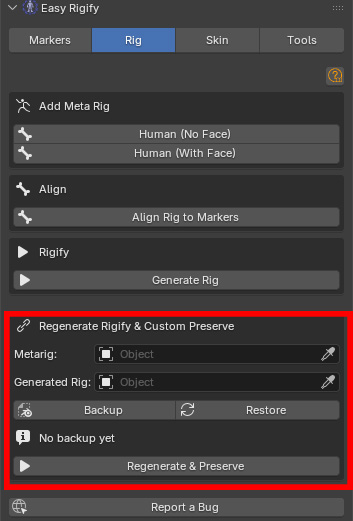

# Rig Tab

==============================================================================

EASY RIGIFY —RIG DOCUMENTATION

**Complete guide to the Rig tab**

==============================================================================

**Version: 1.0 | Panel location: View3D > Sidebar > Easy Rigify**

**For Blender 4.2+**

==============================================================================

**SECTION 1 — OVERVIEW AND WORKFLOW**

=============================================================================

You add a metarig (the editable skeleton template), click Align Rig to

Markers to snap every metarig bone to the markers you placed, then click

Generate Rig to run Rigify and produce the Rigify rig.

After the rig is generated, all markers are automatically deleted. You then

move to the Skin tab to bind your meshes.

Prerequisites

─────────────

- Rigify add-on must be enabled (Edit > Preferences > Add-ons > Rigify).
- Your character mesh should be in the scene at the correct scale.

==============================================================================

**SECTION 2 — RIG TAB**

============================================================================

Open: View3D > Sidebar (N panel) > Easy Rigify > Rig tab

The Rig tab handles three sequential operations:

1. Adding the metarig template to the scene

2. Aligning the metarig bones to your markers

3. Generating the final Rigify rig

It also provides a Custom Preserve system for safely regenerating a rig

after markers and rig tweaks.

─────────────────────────────────────────────────────────────────────────────

**3.1 ADD META RIG [box]**

─────────────────────────────────────────────────────────────────────────────

The metarig is the editable skeleton template that Rigify uses. You add it

once, align it to your markers, then generate the final rig from it.

You do NOT animate with the metarig — it is only for setup.

HUMAN (NO FACE) [button]

─────────────────────────

Imports a pre-configured Rigify Human metarig that includes:

- Full spine (pelvis, spine chain, neck, head)
- Both arms with wrists and hands
- Both legs with feet, toes, and heels
- All fingers (thumb + 4 fingers per hand)

Does NOT include face bones. The generated rig will have no facial

controls.

Use for:

- Game characters (face controls are expensive and often unnecessary)
- Body-only characters
- Characters where you will paint facial shapes manually (shape keys)

rather than using a bone-driven face rig

HUMAN (WITH FACE) [button]

────────────────────────────

Imports a Rigify Human metarig that includes all body bones PLUS the full

Rigify face rig:

- Jaw, teeth, and tongue bones
- Lip and mouth control bones
- Nose bones
- Eye and eyelid bones
- Brow bones
- Cheek, chin, and jaw bones
- Forehead and temple bones

Use for:

- Dialogue characters that require facial animation
- Characters where you have placed face markers using the Markers tab

NOTE: A face rig adds significant complexity to the metarig. After

adding it you must place face markers (Markers tab, step ⑥) and run

Align Rig to Markers before generating. The face rig without alignment

will not match your character.

Both buttons also add the metarig to the Blender Add menu:

Add > Armature > Human (No Face) / Human (With Face)

─────────────────────────────────────────────────────────────────────────────

**3.2 ALIGN [box]**

─────────────────────────────────────────────────────────────────────────────

ALIGN RIG TO MARKERS [button]

───────────────────────────────

The core operation of the addon. Reads every placed marker and moves each metarig bone head/tail to the marker.

Requirements before clicking:

- The metarig must be the ACTIVE object.
- Body markers must be placed (step ①–③ in the Markers tab).
- If you added a With Face metarig, face markers must also be placed.

A dialog box appears with two options:

Apply Bone Roll [checkbox, default ON]

─────────────────────────────────────────

When ON, the bone roll (the rotation of each bone around its local

Y axis) is recalculated after alignment. This ensures DEF bones

point in the correct anatomical direction for deformation.

Leave ON unless you have manually set custom bone rolls on the

metarig and want to preserve them.

Align Face Bones [checkbox, default ON]

──────────────────────────────────────────

When ON, face bones are aligned using the face markers.

When OFF, face bones are left in their default metarig positions.

Turn OFF only if:

- You are using a No Face metarig (no face bones exist).
- You want to manually position face bones without marker help.

After alignment:

- All markers are automatically deleted.
- The mesh selection restriction is lifted so you can see the result.
- You should inspect the metarig and manually tweak any bone that did

not align correctly (rare, but can happen on very stylised characters).

─────────────────────────────────────────────────────────────────────────────

**3.3 RIGIFY [box]**

─────────────────────────────────────────────────────────────────────────────

GENERATE RIG [button]

──────────────────────

Runs Rigify's built-in Generate step on the active metarig.

What happens:

1. The addon sets the correct primary_rotation_axis on finger bones (required by Rigify for correct finger curl direction).

2. Rigify generates the full control rig with all its FK/IK switching, stretch bones, bendy bones, and WGTS_ widget collection.

3. The metarig is hidden (not deleted — it is kept in case you need to re-align and regenerate).

The generated rig's name defaults to "rig". The metarig's name defaults to "metarig".

Requirements:

- The metarig must be the ACTIVE object.
- Rigify add-on must be enabled.
- Align Rig to Markers must have been run.

After generation:

- Move to the Skin tab to bind your character meshes.
- You can delete the WGTS_ collection if you do not need the custom

bone widgets visible in the outliner (they will still work).

─────────────────────────────────────────────────────────────────────────────

**3.4 REGENERATE RIGIFY & CUSTOM PRESERVE [box]**

─────────────────────────────────────────────────────────────────────────────

This section lets you safely regenerate the rig after making changes to the

metarig without losing any custom work you have done on the generated rig

(custom bone shapes, constraint tweaks, custom properties, etc.).

WHY YOU NEED THIS:

Rigify's standard Generate button overwrites the generated rig completely.

Any manual changes you made to the generated rig are erased. The Backup →

Restore → Regenerate workflow preserves those changes.

Metarig [object picker]

─────────────────────────

The source metarig to regenerate from. Pick the metarig object (usually

named "metarig").

Generated Rig [object picker]

────────────────────────────────

The existing generated rig that contains custom changes you want to

preserve. Pick the rig object (usually named "rig").

BACKUP [button]

─────────────────

Reads and saves a snapshot of all custom data from the Generated Rig into

memory (stored as JSON in the scene).

What is backed up:

- Custom bone shapes (bone.custom_shape)
- Custom properties on bones
- Constraint settings
- Bone group colours

Run BACKUP before making any metarig changes.

RESTORE [button]

──────────────────

Applies the saved backup data back to the (newly generated) rig.

Run RESTORE after regenerating the rig to put your custom data back.

Backup ready / No backup yet [status label]

──────────────────────────────────────────────

Shows whether a backup is currently stored. Always check this before

running Regenerate & Preserve.

REGENERATE & PRESERVE [button]

────────────────────────────────

Performs the full three-step process in a single click:

1. Backup — saves custom data from the existing generated rig

2. Generate — runs Rigify Generate on the metarig

3. Restore — applies the backup to the new rig

This is the button to use after any metarig edit (bone position, Rigify

parameters, new bones added).

IMPORTANT: Both Metarig and Generated Rig must be set before clicking.

If either picker is empty the operation cannot proceed.

==============================================================================

**SECTION 4 — FULL WORKFLOW — STEP BY STEP**

==============================================================================

1. Open the Rig tab. Click Human (With Face).

2. Select the metarig. Click Align Rig to Markers.

In the dialog: Apply Bone Roll = ON, Align Face Bones = ON.

Click OK.

3. Inspect the face bones. The jaw, lip, and eye bones should sit just

inside the mesh surface. Adjust in Edit Mode as needed.

**14. Click Generate Rig.**

── **REGENERATING AFTER METARIG CHANGES** ────────────────────────────────────

Use this if you need to re-align and regenerate after the rig is already

in use (e.g. weights are painted, custom shapes were assigned).

1. In the Rig tab, Regenerate Rigify & Custom Preserve section:

- Pick your metarig in the Metarig field.
- Pick your generated rig in the Generated Rig field.

2. Click BACKUP. Confirm "Backup ready" appears.

3. Make your metarig changes (re-align bones, adjust Rigify parameters,

etc.).

4. Click REGENERATE & PRESERVE.

The rig is regenerated and your custom data is restored.

==============================================================================

**SECTION 5 — TIPS, WARNINGS, AND TROUBLESHOOTING**

==============================================================================

**General**

───────

- All markers must be on the SAME SIDE of the mirror plane as their name

implies (_L = positive X, _R = negative X) for the alignment to work.

Auto Detect handles this automatically.

- If your character has a non-standard scale (e.g. imported at 0.01 from

a game engine), apply all transforms (Ctrl+A > All Transforms) BEFORE

running Auto Detect or Place Arm Markers. The detection reads world-

space positions, so a tiny scale produces tiny results.

**Alignment**

─────────

- Always select the METARIG before clicking Align Rig to Markers.

The operator reads the active object to find the armature.

- After alignment, check the metarig in Edit Mode before generating.

Common issues:

– Heel bones have the wrong angle: adjust the heel.02.L/R tails.

– Pelvis is too high or too low: move the PELVIS marker and re-align.

– Finger bones are not straight: re-run Place Finger Markers and

re-align.

- The alignment deletes all markers when it finishes. If you want to

keep markers for a second pass, duplicate the scene before aligning.

**Regenerate & Preserve**

─────────────────────

- The Backup stores data in the scene file. Saving the file after Backup

means the backup survives a Blender restart.

- The Restore step matches bones by NAME. If you renamed bones on the

generated rig, those bones will not receive their custom data back.

- Regenerate & Preserve does NOT preserve vertex group weights on meshes.

If you re-skin the character after a regeneration, the mesh weights will

still be there because vertex groups are on the mesh, not the rig.

However, if Rigify renames or removes any DEF bones, those vertex groups

will become orphans. Run Remove Unused Groups (Skin tab > Cleanup) after

a regeneration to clean them up.

**Troubleshooting**

───────────────

"No markers found" after Align Rig

→ Markers may have been accidentally moved outside the RigifyMarkers

collection. Check the outliner. You can also run Delete All Markers

and redo placement.

Metarig looks correct but Generated Rig bones are wrong

→ Some Rigify bone types compute their final shape from metarig

parameters rather than just bone positions. For fingers, make sure

Align Rig to Markers ran with Apply Bone Roll ON. For the face, make

sure Align Face Bones was ON.

"Could not add metarig — is Rigify enabled?"

→ Enable Rigify: Edit > Preferences > Add-ons > search "Rigify" > tick.

Face detection places markers in wrong positions

→ Confirm the correct mesh is assigned in each picker. On characters

with open mouths or unusual proportions, lip detection may project

onto the inside of the mouth. Move the FACE_LIP_T and FACE_LIP_B

markers manually to the correct lip surface positions.

After alignment the spine bones are too short or too long

→ The PELVIS, SPINE_001, SPINE_002, CHEST, NECK, and HEAD markers

control the entire spine chain. If any of these is at the wrong height

the spine segment between them will be wrong. Correct the marker

positions and re-run Align Rig to Markers.

==============================================================================

END OF DOCUMENTATION

==============================================================================