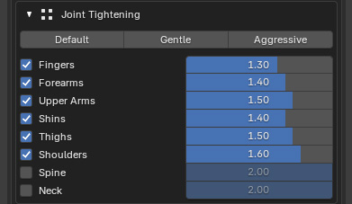
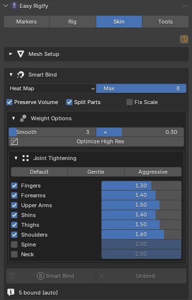
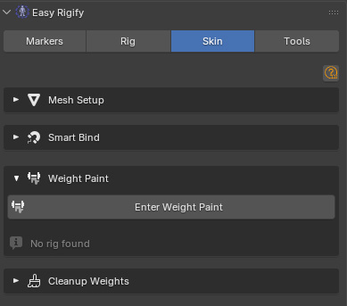
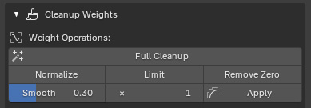
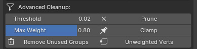
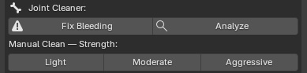
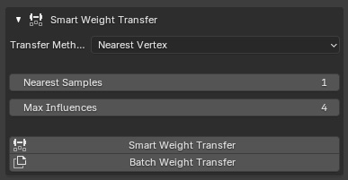

# Skin Tab

================================================================================

**EASY RIGIFY — SKIN TAB DOCUMENTATION**

**Complete guide to Skinning, Advanced Weights, Smart Weight Transfer.**

==============================================================================

**Version: 2.1 | Panel location: View3D > Sidebar > Easy Rigify**

**For Blender 4.2+**

- -------------------------------------------------------------------------------

**HOW TO READ THIS DOCUMENT**

- -------------------------------------------------------------------------------

Each tab/panel is covered in its own section. For every control you will find:

- What it is
- What it does when you change it
- What values to use for different situations
- Tips and warnings

==============================================================================

**SECTION 1 — SKINNING**

**(View3D > Easy Rigify > Skinning panel)**

==============================================================================

The Skinning panel handles the full binding workflow: detecting your meshes,

choosing a bind method, and running Smart Bind. It is the first step before

any weight painting or cleanup.

─────────────────────────────────────────────────────────────────────────────

**1.1 MESH SETUP (collapsible sub-section)**

─────────────────────────────────────────────────────────────────────────────

**DETECT CHARACTER MESHES [button]**

────────────────────────

Scans the scene for all mesh objects and adds them to the list below.

Run this once after placing your character in the scene. Re-run it whenever

you add or remove a mesh.

MESH LIST (one row per mesh found)

─────────

Each row shows:

**[ ✓ ] Checkbox** — tick ON to include this mesh in the next Smart Bind, tick

OFF to skip it. Useful when re-binding just one piece.

**Object Name** — the Blender object name. A checkmark icon means the mesh

already has an Armature modifier (already bound); a dot

icon means it is unbound.

**Mesh Type [dropdown]**

─────────

Choose the correct type so the right bones are used:

**BODY**

— Your main character body/head mesh. All deform bones are used. Use this for torso, arms, legs, and any mesh that needs the full treatment.

**CLOTHING** — Shirts, trousers, jackets, hair, accessories. Treated the same as BODY but Facial bones are exclude from the meshes.

**EYES** — Eyeball mesh. Only eye and master_eye bones are kept; all other groups are stripped after binding.

**TEETH** — Teeth/gum mesh. Only teeth, tooth, are kept.

**TONGUE** — Tongue mesh. Only tongue bones are kept.

TIP: Name your objects clearly (e.g. "Body", "UpperTeeth", "EyeballL") and

the auto-detect will guess the correct type. You can always override it.

─────────────────────────────────────────────────────────────────────────────

**1.2 SMART BIND (main binding section)**

─────────────────────────────────────────────────────────────────────────────

**BIND METHOD [dropdown]**

───────────

How Blender calculates the initial weights. Choose before pressing Smart Bind.

**AUTOMATIC WEIGHT**

Blender's built-in heat diffusion (ARMATURE_AUTO). Fast, good for most

standard characters. No post-processing — weights come out exactly as

Blender produces them. Best for: quick tests, simple characters, or when

you plan to paint everything manually afterward.

**ENVELOPE**

Uses bone envelope volumes instead of heat diffusion. Much faster on high

vertex count meshes but less precise. Use it when Automatic Weight fails

with a "failed to find solution" error (usually caused by interior geometry

or non-manifold topology).

**HEAT MAP (the full pipeline)**

Runs Blender's Automatic Weight first, then passes the result through a

multi-stage post-processing :

Face bones are fully protected: their weights are snapshotted before any

Use HEAT MAP for:

- Final character binding
- When you want clean joint transitions out of the box
- When you want to minimize manual weight painting

**MAX INFLUENCES [slider, 1–8, default 4]**

──────────────

The maximum number of bones that can influence each vertex.

4 — standard for game characters and real-time rendering (recommended).

8 — higher quality deformation for film/VFX, larger file size.

1 — each vertex follows exactly one bone; creates hard seams, almost never

useful for organic characters.

This limit is applied at the end of every bind. It is also used by the

Normalize and Limit buttons in the Cleanup section.

**PRESERVE VOLUME [checkbox]**

───────────────

Enables Dual Quaternion blending on the Armature modifier instead of linear

skinning. Prevents the "candy-wrapper" twisting artifact at elbows and

wrists when a limb rotates.

Turn ON for: most character animations, especially arms.

Turn OFF for: game export (many engines handle blending themselves), or when

you see unexpected volume inflation at joints.

**SPLIT PARTS [checkbox]**

───────────

Separates the mesh into disconnected islands, binds each island

independently, then rejoins them.

Use this for:

- Split teeth (upper and lower as one object)
- Multi-part meshes (e.g. a shirt that is two separate shells sharing one

object)

- Any mesh where some parts fail to get weights from ARMATURE_AUTO

Leave OFF for solid single-piece meshes — it adds processing time.

── **WEIGHT OPTIONS (Heat Map only, collapsible)** ──

**SMOOTH [int slider, 1–20] × SMOOTH FACTOR [0.0–1.0]**

──────────────────────────────────────────────────────

Controls the Laplacian smoothing pass that runs after joint tightening.

**Smooth (iterations)**

How many passes of neighbour-averaging to run.

1–2 = very light, mostly removes spike artefacts

3–5 = standard, good gradient between bones (default 3)

8+ = heavy, can over-blur finger weights

**Smooth Factor**

How much each vertex blends toward the average of its neighbours per pass.

0.1 = very subtle

0.3 = standard (default)

0.7+ = aggressive — only use with 1–2 iterations or you will lose detail

BEST RESULTS: 3 passes × 0.3 factor for a standard body mesh.

2 passes × 0.5 factor for a high-res mesh where gradients

are already fairly clean from ARMATURE_AUTO.

**OPTIMIZE HIGH RES [checkbox]**

─────────────────

For meshes with more than ~30,000 vertices the pipeline first binds a

10% decimated proxy of the mesh, transfers the weights back to the original,

then runs the pipeline stages. Makes binding fast even on 100k+ meshes.

Turn ON when binding takes many minutes and your mesh has over 30k vertices.

Leave OFF for normal characters to preserve maximum precision.

── **JOINT TIGHTENING (collapsible sub-section)** ──

The Surgical Tightening system uses a cylinder around each bone to decide

which vertices are "inside" the bone's zone and which are bleeding.

Vertices outside the cylinder that are NOT the dominant bone at that spot

get their weight reduced by the feather multiplier.

**PRESETS [Default / Gentle / Aggressive]**

────────

Apply a preset set of feather values to all sections at once.

**Default** — moderate cleanup (bleeding reduced to ~35–50%).

Good starting point for most characters.

**Gentle** — light cleanup (bleeding kept at ~65–75%).

Use when ARMATURE_AUTO is already clean and you just want

minor polish.

**Aggressive** — heavy cleanup (bleeding reduced to ~5–25%).

Use when your character has very close-together limbs and

a lot of unwanted cross-bleeding.

**SECTION ROWS** (Fingers / Forearms / Upper Arms / Shins / Thighs /

Shoulders / Spine / Neck)

─────────────────────────────────────────────────────────────────

Each section has two controls:

[ ✓ ] Enable toggle

ON — tightening runs for this bone group.

OFF — this group is left exactly as ARMATURE_AUTO produced it.

Note: Spine and Neck are OFF by default because spine bleeding to the

upper arm is intentional (it creates the smooth gradient at the torso).

The smooth stage handles spine quality instead.

Feather [slider 0.1–2.0]

Controls how aggressively bleeding is reduced outside the bone cylinder.

2.0 = no change at all (same as turning the section off)

1.5 = very gentle — bleeding weight kept at ~75%

1.0 = moderate — bleeding weight kept at ~50%

0.5 = strong — bleeding weight kept at ~25%

0.1 = maximum — bleeding weight kept at ~5%

The feather also controls a gradient ring just outside the cylinder edge.

A smooth blend from 1.0 → feather is applied there, so you never get a

hard cut-line at the cylinder boundary.

**JOINT TRANSITION PROTECTION:** At elbows and knees the adjacent bone

cylinders overlap. The system detects this overlap and never reduces a

bone's weight where it is the dominant influence, so joint transitions

are always preserved regardless of the feather value.

**RECOMMENDED VALUES:**

Fingers 0.7 — fingers are thin; moderate tightening

Forearms 0.8 — elbow area needs some bleed to look natural

Upper Arms 1.0 — shoulder blend is intentional, leave mostly alone

Shins 0.8 — knee area similar to elbow

Thighs 1.0 — hip blend is intentional

Shoulders 1.2 — very gentle, mostly just removes cross-body bleed

Spine OFF — let smooth handle the spine gradient

Neck OFF — let smooth handle the neck gradient

**── SMART BIND button ──**

**SMART BIND [large button]**

──────────

Runs the selected bind method on all enabled meshes.

After completion, a status line appears below the button showing how many

meshes were bound, and whether any fell back to Envelope or failed.

**UNBIND [button]**

──────

Removes the Armature modifier and ALL vertex groups from the currently active

mesh object. Does not affect other meshes.

Use before re-binding a single mesh.

==============================================================================

**SECTION 2 — ADVANCED WEIGHTS**

**(View3D > Easy Rigify > Advanced Weights panel)**

==============================================================================

Advanced Weights covers everything you need after the initial bind: weight

painting workflow helpers, post-bind cleanup, symmetry tools, joint cleaning,

smart smoothing, and weight visualization.

─────────────────────────────────────────────────────────────────────────────

**2.1 WEIGHT PAINT (collapsible)**

─────────────────────────────────────────────────────────────────────────────

**ENTER WEIGHT PAINT [button]**

──────────────────

Enters Weight Paint mode on the active mesh with the rig correctly linked.

Unlike Blender's default weight paint entry, this button:

- Shows DEF bones automatically so you can click them to change groups
- Sets up the rig in Pose mode alongside the mesh
- Highlights zero-weight vertices so unweighted areas are visible
- Saves the previous DEF bone visibility so it can be restored on exit

**How to use:**

1. Select your character mesh in the viewport

2. Click Enter Weight Paint

3. Click any bone on the rig to switch to painting that vertex group

4. Paint as normal

**EXIT WEIGHT PAINT [button]**

─────────────────

Exits Weight Paint mode and restores DEF bone visibility to whatever state

it was in before you entered.

**SHOW / HIDE DEF BONES [toggle button]**

─────────────────────

Toggles visibility of the DEF bone layer on the Rigify rig. DEF bones are

the actual deform bones (prefixed DEF-). Useful to quickly check which

bones are present without entering Weight Paint.

─────────────────────────────────────────────────────────────────────────────

**2.2 CLEANUP WEIGHTS (collapsible)**

─────────────────────────────────────────────────────────────────────────────

**WEIGHT OPERATIONS**

**FULL CLEANUP [button]**

────────────

Runs all four cleanup operations in one click:

1. Remove Zero — strips weights below 0.001

2. Limit — enforces Max Influences (from the Skinning panel)

3. Normalize — makes all bone weights at each vertex sum to 1.0

4. Smooth — runs a gentle Laplacian smooth

Run after manual weight painting to tidy everything up.

Safe to run multiple times.

**NORMALIZE [button]**

─────────

Divides each vertex's weights so they sum exactly to 1.0.

Does not remove any bones or change which bones influence a vertex — just rescales the values.

Use when: you have painted weights that look correct visually but the mesh deforms with unexpected volume changes.

**LIMIT [button]**

─────

Removes the lowest-weight bones from any vertex that has more influences than

Max Influences, keeping only the strongest ones, then renormalizes.

Use when: you need to match a game engine bone limit, or when Full Cleanup

produced vertices with too many small influences.

**REMOVE ZERO [button]**

───────────

Deletes any vertex group entry where the weight is below 0.001.

Does not renormalize — run Normalize afterward if needed.

Use when: vertex groups have accumulated many near-zero garbage values from

painting operations.

**SMOOTH [Factor slider 0.0–1.0] × [Passes int 1–5] APPLY [button]**

─────────────────────────────────────────────────────────────────────

A targeted Laplacian smooth that protects face, finger, forearm, and palm

bones from being smoothed (they need precise weights). All other bones are

blended toward their neighbors.

Factor — blend strength per pass (0.3 = standard, 0.7 = heavy)

Passes — number of iterations (1 = very subtle, 3–5 = noticeable)

Apply — runs the smooth with these settings

Use when: you see sharp weight borders between bones after painting that

cause visible hard-edge creases during animation.

**ADVANCED CLEANUP**

**THRESHOLD [float 0.001–0.100] PRUNE [button]**

────────────────────────────────────────────────

Prune Small Weights: zeros out every bone weight below the threshold on the

active mesh, then renormalizes.

0.010 — standard (removes negligible influences)

0.050 — more aggressive, good for game characters with strict bone limits

0.001 — minimal, only removes truly zero values

TIP: Use Prune before Limit to make sure the "kept" bones are only meaningful

ones, not tiny bleed weights that shouldn't count toward the limit.

MAX WEIGHT [slider 0.10–1.0] CLAMP [button]

────────────────────────────────────────────────

Clamp Active Bone: caps the weight of the currently active vertex group so

no vertex has more than Max Weight for that bone. The excess weight is

redistributed proportionally to the other bones at that vertex.

0.80 — standard cap (bone can be at most 80% dominant)

0.60 — forces more blending with neighbours

1.0 — effectively disables clamping

Use when: a single bone looks too rigid or "sticky" — parts of the mesh

follow it 100% when they should be blending with adjacent bones.

**How to use:**

1. In Weight Paint, select the bone group you want to cap

2. Go back to Object mode (or stay in Weight Paint — both work)

3. Set Max Weight

4. Click Clamp

**REMOVE UNUSED GROUPS [button]**

─────────────────────

Deletes every vertex group where ALL vertices have zero weight. This happens

after binding when the rig has bones that are far from the mesh and get no

heat diffusion.

Always safe to run. Keeps your vertex group list clean and speeds up

weight painting navigation.

**UNWEIGHTED VERTS [button]**

────────────────

Selects all vertices that have no bone influence at all (total weight = 0.0).

Switches to Edit Mode so you can see which vertices are unweighted.

Use when: you have dark patches in Weight Paint that are unexplained, or

after Prune removes too much and leaves some vertices empty.

**MIRROR / SYMMETRY**

**SYM L→R [button]**

────────

Copies all vertex weights from the LEFT side of the mesh (+X) to the RIGHT

side (-X). Bone names are automatically flipped (.L → .R).

Vertices are matched by mirroring their X position.

Use after painting the left side to completion.

**SYM R→L [button]**

────────

Same, in reverse direction.

TIP: These buttons use a 10mm position tolerance to handle slightly

asymmetric mesh topology. They will NOT work on a mesh that has no mirror

symmetry at all (e.g. a fully unique organic shape).

**JOINT CLEANER**

**FIX BLEEDING [button]**

────────────

Runs the automated joint bleeding fixer. Analyses each DEF bone's weight

distribution and reduces weights that have spread too far from the bone's

actual geometry zone.

Uses per-bone-type radius multipliers:

Spine, shoulders — light (allows intentional cross-body blend)

Upper arm, thigh — moderate

Forearm, shin — moderate-tight

Fingers — tight (small bones, bleeding is more visible)

NOTE: .001 transition bones (DEF-upper_arm.L.001, DEF-thigh.L.001, etc.)

are protected and will NOT be cleaned — they are joint-transition bones by

design and need the blended weight they have.

**ANALYZE [button]**

───────

Prints a per-bone bleeding report to the System Console without making any

changes. Shows which bones are bleeding and by how much.

Use before Fix Bleeding to understand what the fixer will do.

**MANUAL CLEAN — LIGHT / MODERATE / AGGRESSIVE [buttons]**

───────────────────────────────────────────────────────

Manual cleaning presets for when you want direct control. Select the mesh,

make sure you are in Object mode, then click the desired strength.

Light — removes only obvious long-range bleeding

Moderate — balanced cleanup, similar to Fix Bleeding auto mode

Aggressive — tight cleanup, may remove some intentional blending at joints

**SMOOTH TWIST WEIGHTS [button]**

────────────────────

Applies a targeted smooth specifically to twist bone pairs (the .001 limb

bones: DEF-upper_arm.L.001, DEF-forearm.L.001, DEF-thigh.L.001, etc.).

Smooths the gradient between the main bone and its twist partner.

Use when: you see a visible stripe or hard line on the upper arm or thigh

during arm/leg twisting animations.

─────────────────────────────────────────────────────────────────────────────

**2.3 SMART SMOOTHING (always visible)**

─────────────────────────────────────────────────────────────────────────────

**SMOOTH WEIGHTS [button]**

──────────────

Runs the Smart Smoother — a topology-aware Laplacian smooth that can

optionally respect mesh boundaries, UV seams, and material boundaries.

Unlike the simple smooth in Cleanup, this one follows the actual edge flow

of the mesh, so gradients look more natural.

When you click the button a popup dialog appears with:

Process — type of operation (will be set to Smart Smooth for this button)

Bone Group — leave empty to smooth all bones, or type a specific vertex

group name to smooth only that bone

Smooth Iterations [1–20, default 5]

Number of smoothing passes. 5 is a good default.

Smooth Factor [0.0–1.0, default 0.5]

Blend strength per pass. 0.5 is stronger than the cleanup smooth's 0.3.

Edge Flow Weight [0.0–1.0, default 0.7]

Controls how much the smooth follows the mesh's existing weight gradients.

1.0 — full edge-flow: the smooth flows strongly along edges where the

weight changes the most (high gradient), producing directional

gradients that follow anatomy.

0.0 — uniform: all edges are treated equally, same as a plain Laplacian

smooth.

0.7 — recommended default: mostly follows edge flow with some uniform

averaging to prevent artefacts.

TIP: Smart Smoothing is the best tool for fixing "blocky" weight zones on

high-res characters where you need the smooth to follow the mesh topology

rather than just averaging in all directions.

==============================================================================

**SECTION 3 — SMART WEIGHT TRANSFER**

**(View3D > Easy Rigify > Smart Weight Transfer panel)**

==============================================================================

Smart Weight Transfer copies vertex group weights from one mesh to another.

This is used when you have one well-painted mesh (the SOURCE) and want to

apply its weights to a related mesh (the TARGET) without binding from scratch.

**Common use cases:**

- Transferring body weights onto a shirt or jacket
- Updating a revised mesh version with weights from the old version
- Copying weights from a decimated/proxy mesh to the final high-res mesh

─────────────────────────────────────────────────────────────────────────────

**HOW TO USE**

─────────────────────────────────────────────────────────────────────────────

1. Select all objects involved in the transfer

2. Make the SOURCE mesh the ACTIVE object (last selected, highlighted)

3. Choose your settings below

4. Click Smart Weight Transfer (single target) or Batch Transfer (all

selected non-active meshes at once)

─────────────────────────────────────────────────────────────────────────────

**3.1 SETTINGS**

─────────────────────────────────────────────────────────────────────────────

**TRANSFER METHOD [dropdown]**

───────────────

The algorithm used to look up which source vertices to copy from.

**NEAREST VERTEX**

For each target vertex, finds the closest source vertex (or the N closest,

then blends by distance) and copies that vertex's weights.

**Best for:**

- Meshes that are very similar in shape (e.g. original mesh → revised mesh)
- Skin-tight clothing
- Fast general-purpose transfers

Not ideal for:

- Clothing that sits far from the body surface (thick jackets, puffy coats)

**SURFACE PROJECTION**

Projects each target vertex along its surface normal, finds nearby source

vertices within the Search Radius, and blends their weights weighted by

how well the source vertex's position aligns with the target vertex's

normal direction.

**Best for:**

- Clothing that sits slightly above the body surface
- Accessories (belts, straps, armor pieces)
- Any mesh where the topology differs significantly from the source

Requires tuning Search Radius for each situation.

**VOLUME SAMPLING**

For each target vertex, casts multiple samples along the vertex normal at

different depths (from -depth to +depth) and blends the results.

Captures weights from both the outer surface and slightly below it.

**Best for:**

- Thick clothing (coats, armour)
- Meshes that partially envelop the source
- Situations where nearest-vertex gives patchy results

**NEAREST SAMPLES [int 1–10] (Nearest Vertex only)**

───────────────

How many nearby source vertices are considered and blended per target vertex.

1 = copies exactly from the single nearest vertex — fast, but can give

sharp weight borders if the source mesh topology is coarse.

3–5 = blends from the 3–5 nearest, weighting closer ones more heavily.

Produces smoother results on mismatched topology.

10 = maximum blending — very smooth but slower.

For meshes with similar topology, 1 is fine. For mismatched meshes use 3–5.

**SEARCH RADIUS [float 0.001–10.0, default 0.1] (Surface Projection only)**

─────────────

The radius (in scene units, usually metres) within which source vertices are

searched for each target vertex.

0.05 — very tight, only vertices almost directly on the surface

0.10 — standard (default), good for most body-to-clothing transfers

0.30 — wide, good for thick jackets or armour that sits far from the body

1.0+ — use only if geometry is very spread out

TIP: If some vertices get no weights transferred, increase Search Radius.

If weights look blurry or mixed from wrong areas, decrease it.

**VOLUME SAMPLES [int 2–20, default 5] (Volume Sampling only)**

──────────────

How many depth samples to take along the vertex normal.

2 = only the endpoints of the depth range (faster)

5 = standard, good balance of quality and speed

10+ = high quality, slower

**MAX INFLUENCES [int 0–32, default 4]**

──────────────

Limits how many bones can influence each target vertex after transfer.

0 = unlimited (keep all bones the source had).

Set to match your character's game/render requirements.

4 is the standard game character limit.

─────────────────────────────────────────────────────────────────────────────

**3.2 BUTTONS**

─────────────────────────────────────────────────────────────────────────────

**SMART WEIGHT TRANSFER [button]**

─────────────────────

Transfers weights from the active (source) mesh to ONE other selected mesh.

If multiple meshes are selected, only the first non-active one receives weights.

**BATCH WEIGHT TRANSFER [button]**

─────────────────────

Transfers weights from the active (source) mesh to ALL other selected meshes

in a single operation. Each target receives its own independent transfer.

Use this to re-bind multiple clothing pieces at once after updating the body.

─────────────────────────────────────────────────────────────────────────────

**3.3 TIPS FOR BEST RESULTS**

─────────────────────────────────────────────────────────────────────────────

- The source mesh should have clean, fully normalized weights before

transferring.

- Make sure both source and target are at the same scale and orientation

in world space. The transfer uses world-space positions, so a source mesh

at 0.01 scale will give wrong results.

- After transfer, run Normalize + Limit on the target to ensure weights

sum to 1.0 and respect the influence limit.

- For a perfect skin-tight shirt: bind the body first with HEAT MAP, then

use Nearest Vertex (1 sample) to copy body weights to the shirt — much

faster than re-running the weight paint.

==============================================================================

**QUICK REFERENCE — RECOMMENDED WORKFLOW**

==============================================================================

**── FIRST-TIME BINDING ──**

1. Place markers → Align Rig → Generate Rig (using the main Easy Rigify tabs)

2. Open Skinning panel → Detect Character Meshes

3. Assign mesh types (Body, Eyes, Teeth, Tongue, Clothing)

4. Set Bind Method to HEAT MAP

5. In Weight Options: Smooth 3 × 0.3, leave Optimize High Res OFF unless needed

6. In Joint Tightening: apply DEFAULT preset

7. Click Smart Bind

8. Open Advanced Weights → Cleanup Weights → Full Cleanup

**── FIXING SPECIFIC PROBLEMS ──**

Problem | Solution

─────────────────────────────────────────────────────────────────────────

Arm bleeds into torso/spine | Increase Upper Arms feather toward 0.5–0.8

Elbow looks pinched | Lower Forearms feather to 0.6, or add Fan Bones

Knee looks pinched | Lower Shins feather to 0.6, or add Fan Bones

Sharp weight border crease | Run Smart Smoothing (edge flow weight 0.7)

Finger weights on palm | Fingers feather 0.5 or lower

Face bones not deforming | Confirm rig has face (With Face option in

| Easy Rigify > Meta Rig); re-bind with Heat Map

Clothing mismatched weights | Smart Weight Transfer (Nearest, 3 samples)

Unweighted vertices | Advanced Weights → Select Unweighted Verts,

| then paint manually

Too many influences for game | Reduce Max Influences to 4, run Limit + Normalize

================================================================================

END OF DOCUMENTATION

================================================================================